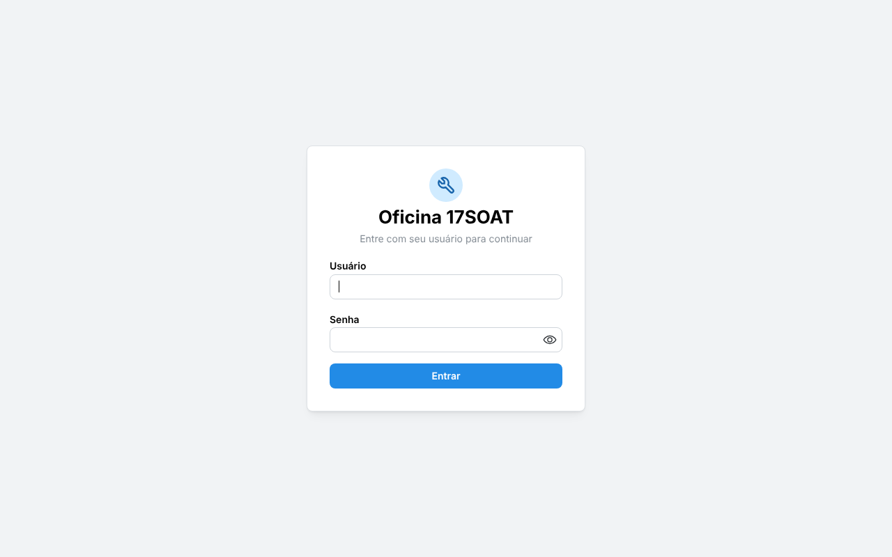
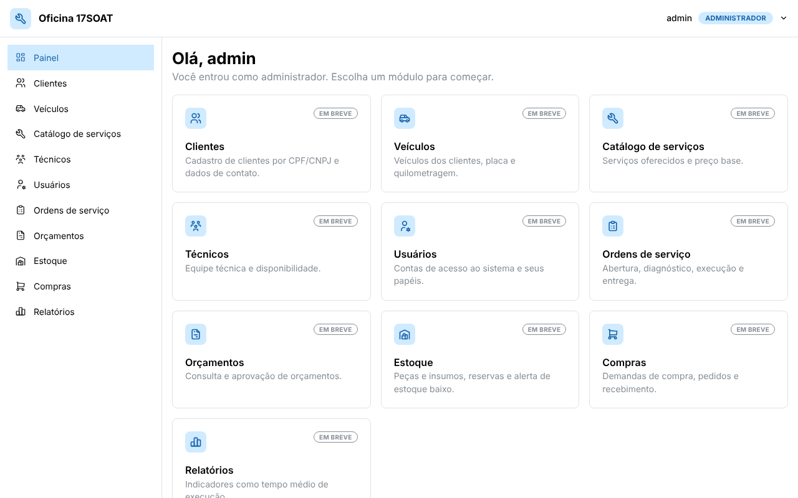

# Oficina 17SOAT · Frontend

Interface web do **sistema de gestão de oficina mecânica** desenvolvido no curso 17SOAT. Ela consome a API do
repositório [17SOAT-workshop-management-system](https://github.com/SystemIvan/17SOAT-workshop-management-system)
(Spring Boot + MySQL) e cobre, de forma incremental, todas as funcionalidades da API: cadastros, ordens de serviço,
orçamentos, execução, estoque, compras e relatórios.





---

## Sumário

- [Situação atual](#situação-atual)
- [Tecnologias](#tecnologias)
- [Arquitetura](#arquitetura)
- [Como executar](#como-executar)
  - [Opção 1: tudo no Docker (frontend + backend)](#opção-1-tudo-no-docker-frontend--backend)
  - [Opção 2: só o frontend no Docker](#opção-2-só-o-frontend-no-docker)
  - [Opção 3: desenvolvimento local com Vite](#opção-3-desenvolvimento-local-com-vite)
- [Usuários de teste](#usuários-de-teste)
- [Variáveis de ambiente](#variáveis-de-ambiente)
- [Autenticação e papéis](#autenticação-e-papéis)
- [Estrutura do projeto](#estrutura-do-projeto)
- [Scripts](#scripts)
- [Testes e CI](#testes-e-ci)
- [Como adicionar um módulo](#como-adicionar-um-módulo)
- [Roteiro de entrega](#roteiro-de-entrega)
- [Solução de problemas](#solução-de-problemas)

---

## Situação atual

Esta é a **fase 1** (fundação). Já funciona:

- Login com usuário e senha usando o JWT emitido pelo backend (`POST /api/auth/login`).
- Sessão persistida no navegador e encerrada automaticamente quando o token expira (1 hora, sem refresh no backend)
  ou quando a API responde `401`.
- Rotas protegidas por papel (`ADMIN`, `MANAGER`, `TECHNICIAN`, `CUSTOMER`), espelhando as regras do
  `SecurityConfig` do backend. Quem não tem permissão cai em **Acesso negado**.
- Menu lateral e painel inicial que mostram só os módulos do papel do usuário.
- Cliente HTTP único que envia o token, entende o formato de erro do backend (`{ code, message }`) e repassa
  parâmetros de lista no formato que a API espera (`?type=PART&type=SUPPLY`).
- Imagem Docker de produção (Nginx) e `docker-compose` que sobe frontend e backend juntos.

Os demais módulos já aparecem no menu com a etiqueta **Em breve** e ganham telas nas próximas fases
(veja o [roteiro](#roteiro-de-entrega)).

## Tecnologias

| Camada               | Escolha                                                                 |
| -------------------- | ----------------------------------------------------------------------- |
| Linguagem            | TypeScript (modo `strict`)                                              |
| Build / dev server   | [Vite](https://vite.dev)                                                |
| UI                   | [React 19](https://react.dev) + [Mantine 9](https://mantine.dev)        |
| Rotas                | [React Router](https://reactrouter.com)                                 |
| Dados do servidor    | [TanStack Query](https://tanstack.com/query)                            |
| Formulários          | [React Hook Form](https://react-hook-form.com) + [Zod](https://zod.dev) |
| Ícones               | [Tabler Icons](https://tabler.io/icons)                                 |
| Testes               | [Vitest](https://vitest.dev) + Testing Library                          |
| Servidor de produção | Nginx (imagem `nginx:alpine`)                                           |

## Arquitetura

O backend **não tem CORS habilitado**. Por isso o navegador nunca chama a API diretamente: ele fala só com o servidor
do frontend, que repassa tudo o que começa com `/api` para o backend. Assim frontend e API ficam na mesma origem.

```
                      ┌──────────────────────── rede Docker: workshop-network ───────────────────────┐
                      │                                                                              │
 Navegador ──HTTP──▶  │  workshop-frontend (Nginx :80)                                               │
 localhost:3000       │    ├── /            → arquivos estáticos do React (SPA)                      │
                      │    └── /api/**      → proxy ──▶ workshop-app (Spring Boot :8080) ──▶ MySQL    │
                      │                                         └──▶ supplier-simulator (WireMock)   │
                      └──────────────────────────────────────────────────────────────────────────────┘
```

- **Produção (Docker):** o Nginx faz o proxy. O destino vem da variável `BACKEND_URL`
  (padrão `http://app:8080`, o nome do serviço no compose do backend).
- **Desenvolvimento (`npm run dev`):** o próprio Vite faz o proxy de `/api` para `BACKEND_URL`
  (padrão `http://localhost:8080`).

## Como executar

### Pré-requisitos

- [Docker](https://docs.docker.com/get-docker/) com Docker Compose **2.20 ou mais novo** (usamos `include:`).
  Confira com `docker compose version`.
- Para desenvolvimento local: [Node.js](https://nodejs.org) **20.19+** (recomendado 22).

### Opção 1: tudo no Docker (frontend + backend)

O `docker-compose.yml` deste repositório **inclui** o compose do backend, então um único comando sobe API, MySQL,
simulador de fornecedor e o frontend.

1. Clone os dois repositórios **lado a lado**:

   ```bash
   git clone https://github.com/SystemIvan/17SOAT-workshop-management-system.git
   git clone https://github.com/SantiagoSilvestre/17SOAT-workshop-frontend.git
   ```

   ```
   pasta-de-trabalho/
   ├── 17SOAT-workshop-management-system/   ← backend (use a branch dev, a mais atualizada)
   └── 17SOAT-workshop-frontend/            ← este repositório
   ```

   > Se o backend estiver em outro lugar, informe o caminho em `BACKEND_PATH` no arquivo `.env`
   > (veja [Variáveis de ambiente](#variáveis-de-ambiente)).

2. Na pasta do backend, use a branch de integração:

   ```bash
   cd 17SOAT-workshop-management-system && git checkout dev && cd ..
   ```

3. Suba tudo a partir da pasta do frontend:

   ```bash
   cd 17SOAT-workshop-frontend
   cp .env.example .env          # opcional: só se quiser mudar portas/caminhos
   docker compose up -d --build
   ```

   A primeira execução demora alguns minutos (o Maven baixa as dependências do backend).

4. Acesse:

   | Serviço                       | Endereço                                    |
   | ----------------------------- | ------------------------------------------- |
   | **Frontend**                  | http://localhost:3000                       |
   | API (direto)                  | http://localhost:8080                       |
   | Swagger da API                | http://localhost:8080/swagger-ui.html       |
   | Simulador de fornecedor       | http://localhost:8089                       |
   | MySQL                         | `localhost:3306` (usuário `workshop_user`)  |

5. Comandos úteis:

   ```bash
   docker compose ps                 # situação dos containers
   docker compose logs -f frontend   # logs do Nginx
   docker compose logs -f app        # logs da API
   docker compose down               # para tudo (mantém os dados do MySQL)
   docker compose down -v            # para tudo e APAGA o banco
   ```

### Opção 2: só o frontend no Docker

Útil quando o backend já está rodando por conta própria (por exemplo com `make docker-up` no repositório dele).

```bash
docker compose -f docker-compose.standalone.yml up -d --build
```

Por padrão o Nginx repassa `/api` para `http://host.docker.internal:8080`, isto é, a API exposta na porta 8080 da sua
máquina. Para apontar para outro endereço:

```bash
BACKEND_URL=http://minha-api:8080 docker compose -f docker-compose.standalone.yml up -d --build
```

Também dá para usar a imagem sem compose:

```bash
docker build -t workshop-frontend .
docker run --rm -p 3000:80 -e BACKEND_URL=http://host.docker.internal:8080 \
  --add-host=host.docker.internal:host-gateway workshop-frontend
```

### Opção 3: desenvolvimento local com Vite

Com o backend rodando em `http://localhost:8080` (por Docker ou pela IDE):

```bash
npm install
npm run dev
```

Abra http://localhost:5173. O Vite recarrega a página a cada alteração e repassa `/api` para o backend. Se a API
estiver em outro endereço:

```bash
BACKEND_URL=http://localhost:9090 npm run dev
```

## Usuários de teste

Com o perfil `dev` do backend (padrão no compose dele, com `APP_SEED_ENABLED=true`), estes usuários são criados
automaticamente. **Todos usam a senha `changeme123`.**

| Usuário          | Papel        | O que enxerga                                                        |
| ---------------- | ------------ | -------------------------------------------------------------------- |
| `admin`          | `ADMIN`      | Tudo, inclusive a gestão de usuários                                 |
| `manager.dev`    | `MANAGER`    | Cadastros, ordens de serviço, orçamentos, estoque, compras, relatórios |
| `technician.dev` | `TECHNICIAN` | Ordens de serviço                                                    |
| `customer.dev`   | `CUSTOMER`   | Acompanhamento de ordem e orçamentos                                 |

> Essas credenciais são só para ambiente local. Nunca use o perfil `dev` nem a senha padrão em produção.

## Variáveis de ambiente

Copie `.env.example` para `.env` e ajuste o que precisar. O Docker Compose lê o `.env` automaticamente; o Vite também.

| Variável        | Padrão                                   | Onde é usada         | Para que serve                                                     |
| --------------- | ---------------------------------------- | -------------------- | ------------------------------------------------------------------ |
| `FRONTEND_PORT` | `3000`                                   | compose              | Porta do host onde o frontend fica disponível                      |
| `BACKEND_URL`   | `http://app:8080` (compose)<br>`http://host.docker.internal:8080` (standalone)<br>`http://localhost:8080` (Vite) | Nginx e Vite | Destino do proxy de `/api` |
| `BACKEND_PATH`  | `../17SOAT-workshop-management-system`   | `docker-compose.yml` | Caminho do clone do backend que será incluído no compose           |

As variáveis do backend (`APP_PORT`, `DB_PORT`, `SPRING_PROFILES_ACTIVE`, `APP_SEED_ENABLED`, segredos JWT etc.)
continuam valendo e podem ir no mesmo `.env`. Veja o `.env.example` do backend.

## Autenticação e papéis

1. A tela de login chama `POST /api/auth/login` com `{ username, password }`.
2. O backend devolve `{ token, role, expiresAt }`. O token é um JWT HS256 com as claims `sub` (id da conta),
   `role` e `linkedDomainId` (id do cliente ou técnico vinculado, quando houver).
3. O frontend guarda **só o token e o nome de usuário** no `localStorage` e lê as claims para montar a interface.
   A assinatura é validada apenas pelo backend.
4. Toda chamada leva `Authorization: Bearer <token>`. Se a API responder `401`, a sessão é encerrada e o usuário
   volta para o login. Um temporizador também encerra a sessão no horário de expiração do token.
5. Depois do login o usuário volta para a página que tentou abrir.

Permissões por módulo (baseadas no `SecurityConfig` do backend):

| Módulo                | ADMIN | MANAGER | TECHNICIAN | CUSTOMER |
| --------------------- | :---: | :-----: | :--------: | :------: |
| Painel                |   ✓   |    ✓    |     ✓      |    ✓     |
| Clientes              |   ✓   |    ✓    |            |          |
| Veículos              |   ✓   |    ✓    |            |          |
| Catálogo de serviços  |   ✓   |    ✓    |            |          |
| Técnicos              |   ✓   |    ✓    |            |          |
| Usuários              |   ✓   |         |            |          |
| Ordens de serviço     |   ✓   |    ✓    |     ✓      |          |
| Acompanhar ordem      |       |         |            |    ✓     |
| Orçamentos            |   ✓   |    ✓    |            |    ✓     |
| Estoque               |   ✓   |    ✓    |            |          |
| Compras               |   ✓   |    ✓    |            |          |
| Relatórios            |   ✓   |    ✓    |            |          |

A tabela fica em um só lugar no código: [`src/routes/modules.ts`](src/routes/modules.ts). O menu, o painel e a
proteção das rotas são gerados a partir dela. A proteção no frontend é só de usabilidade; quem garante a segurança
é sempre o backend.

## Estrutura do projeto

```
.
├── Dockerfile                    # build multi-stage: Node (build) → Nginx (runtime)
├── docker-compose.yml            # frontend + stack completa do backend (via include)
├── docker-compose.standalone.yml # só o frontend, apontando para uma API já em execução
├── nginx/
│   └── default.conf.template     # SPA + proxy /api (BACKEND_URL substituído na subida)
├── src/
│   ├── api/
│   │   ├── http.ts               # cliente HTTP: token, erros { code, message }, query params
│   │   └── auth.ts               # chamadas de autenticação
│   ├── auth/
│   │   ├── roles.ts              # papéis e rótulos em português
│   │   ├── token.ts              # leitura das claims do JWT
│   │   ├── session.ts            # sessão (localStorage + assinantes)
│   │   ├── AuthContext.tsx       # contexto React: login, logout, expiração
│   │   └── RequireAuth.tsx       # guarda de rota por autenticação e papel
│   ├── layout/AppLayout.tsx      # cabeçalho, menu lateral e área de conteúdo
│   ├── pages/                    # Login, Painel, Acesso negado, 404, "Em breve"
│   ├── routes/
│   │   ├── modules.ts            # mapa de módulos × papéis (fonte única)
│   │   └── router.tsx            # definição das rotas
│   ├── test/                     # utilitários de teste (JWT falso, render com rotas)
│   ├── theme.ts                  # tema do Mantine
│   ├── App.tsx                   # providers (Mantine, Query, Auth, Router)
│   └── main.tsx                  # ponto de entrada
├── vite.config.ts                # aliases, proxy de desenvolvimento e Vitest
└── .github/workflows/ci.yml      # typecheck, testes, build e build da imagem
```

O alias `@/` aponta para `src/` (ex.: `import { http } from '@/api/http'`).

## Scripts

| Comando              | O que faz                                          |
| -------------------- | -------------------------------------------------- |
| `npm run dev`        | Servidor de desenvolvimento em http://localhost:5173 |
| `npm run build`      | Checa tipos e gera o build de produção em `dist/`  |
| `npm run preview`    | Serve o build de `dist/` localmente                |
| `npm run typecheck`  | Só a checagem de tipos do TypeScript               |
| `npm test`           | Roda os testes uma vez                             |
| `npm run test:watch` | Roda os testes em modo observação                  |

## Testes e CI

Os testes usam Vitest + Testing Library com jsdom e cobrem:

- leitura das claims do JWT e rejeição de tokens inválidos;
- sessão (persistência, expiração e aviso aos assinantes);
- cliente HTTP (token, parâmetros repetidos, conversão de erros, logout em `401`);
- rotas: redirecionamento para o login, bloqueio por papel, menu filtrado, login com retorno à página pedida e
  mensagem de credenciais inválidas.

O GitHub Actions ([`.github/workflows/ci.yml`](.github/workflows/ci.yml)) roda typecheck, testes e build em todo pull
request e também verifica se a imagem Docker é construída.

## Como adicionar um módulo

Exemplo para a tela de clientes (fase 2):

1. Crie as chamadas em `src/api/customers.ts` usando o cliente `http`:

   ```ts
   export const listCustomers = () => http.get<Customer[]>('/customers');
   ```

2. Crie a página em `src/pages/customers/CustomersPage.tsx`, usando `useQuery`/`useMutation` do TanStack Query.
3. Em `src/routes/router.tsx`, troque o `ComingSoonPage` do módulo pela nova página (o `RequireAuth` com os papéis
   continua o mesmo).
4. Se as permissões mudarem no backend, atualize `src/routes/modules.ts` e a tabela deste README.

## Roteiro de entrega

O frontend é entregue em fases, na ordem do mapa de API para telas:

| Fase | Conteúdo                                                                      | Situação     |
| :--: | ----------------------------------------------------------------------------- | ------------ |
|  1   | Fundação: projeto, Docker, login JWT, rotas por papel, layout                 | ✅ Esta entrega |
|  2   | Cadastros: clientes, veículos, catálogo de serviços, técnicos e usuários      | Próxima      |
|  3   | Ordens de serviço (parte 1): abertura, listagem, diagnóstico, prioridade, acompanhamento | Planejada |
|  4   | Orçamentos: geração, consulta e decisão                                       | Planejada    |
|  5   | Execução e entrega: técnico, início, progresso, conclusão, finalização        | Planejada    |
|  6   | Estoque: itens, política de estoque baixo, reservas                           | Planejada    |
|  7   | Compras e relatórios: demandas, pedidos, recebimento, tempo médio de execução | Planejada    |

## Solução de problemas

**`include` não é reconhecido / erro de sintaxe no compose**
Atualize o Docker Compose para 2.20 ou mais novo (`docker compose version`). Como alternativa, suba o backend pelo
repositório dele e use a [opção 2](#opção-2-só-o-frontend-no-docker).

**`path ... docker-compose.yml not found` ao subir**
O backend não está em `../17SOAT-workshop-management-system`. Clone-o ao lado deste repositório ou defina
`BACKEND_PATH` no `.env`.

**O login responde "Não foi possível conectar ao servidor" ou erro 502**
A API ainda está subindo (o Spring Boot leva alguns segundos depois do MySQL ficar saudável). Acompanhe com
`docker compose logs -f app` e tente de novo. Na opção 2, confira se a API responde em http://localhost:8080.

**"Usuário ou senha inválidos" com os usuários de teste**
Os usuários `*.dev` só existem no perfil `dev` com `APP_SEED_ENABLED=true`. Se o banco foi criado com outra
configuração, recrie-o com `docker compose down -v` e suba de novo.

**Fui deslogado sozinho**
O token do backend vale 1 hora e não há refresh. Ao expirar, o frontend volta para o login.

**Porta 3000, 8080 ou 3306 já em uso**
Mude `FRONTEND_PORT`, `APP_PORT` ou `DB_PORT` no `.env`.
